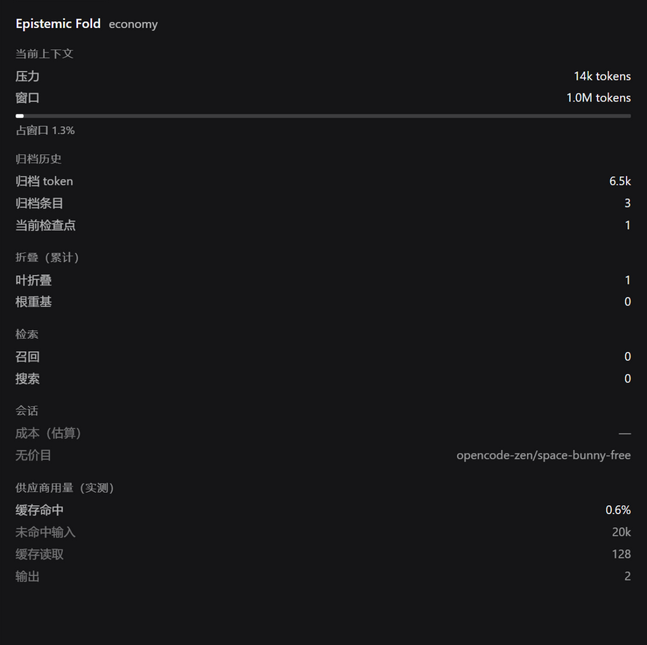

# Epistemic Fold

[](https://github.com/orangeofcarl0-sys/dsh-epistemic-fold/actions/workflows/ci.yml)
[](https://github.com/orangeofcarl0-sys/dsh-epistemic-fold/releases)
[](LICENSE)
[](#ci)
[](docs/README.md)

> **Compaction 应该让上下文更小，而不是让 Agent 忘掉它已经学到的东西。**

**Epistemic Fold** 是 [DeepSeek Harness](https://github.com/deepseek-ai/deepseek-harness)
上的一个 context runtime，面向长周期 Agent。它把旧轨迹折叠出模型的 active context，
同时保证原始历史仍可恢复、frozen prefix 保持稳定、整个过程可观察。

**精确历史始终可恢复。**
**旧轨迹离开热上下文。**
**Agent 继续工作，而不必把有损摘要当成事实来源。**

[English](README.md) · [使用指南](docs/USER_GUIDE.md) · [架构](docs/ARCHITECTURE.md) · [研究归档](docs/README.md)



*来自真实会话的真实渲染。Sidebar 读取与 `/context status` 相同的 status projection，且不进入模型 prompt——未知值显示为 `—`，绝不伪造为 0。*

---

## 问题

长周期 Agent 会积累大量有用的历史：

- 需求以及后来的修订；
- 失败的尝试，以及它们为什么失败；
- 工具输出；
- 实现决策；
- 临时约束；
- 可能几百轮之后才再次用到的事实。

最终这些历史必须离开 active prompt。

通常的做法是把它摘要掉。

这对上下文体积有帮助，但会带来第二个问题：

```text
原始历史
      ↓
   摘要
      ↓
摘要的摘要
      ↓
现在到底还有哪些是成立的？
```

压缩后的叙述可能有用，但它是很差的 canonical record。细节会消失，旧值可能重新看起来
像当前值，而后来的 Agent 可能完全没有办法找回那段被折叠掉的精确来源。

**Epistemic Fold 改的是这个契约。**

```text
                     ┌──────────────────────┐
旧 model-visible ───►│ exact Fold Bundle    │─────┐
history              │ immutable + hashed   │     │
                     └──────────────────────┘     │
                                │                 │
                                ▼                 │
                     ┌──────────────────────┐     │
                     │ compact checkpoint   │     │
                     │ + bounded state      │     │
                     └──────────────────────┘     │
                                │                 │
                                ▼                 │
                          active context          │
                                │                 │
                         需要旧细节？             │
                                └──── search / recall ───► 精确归档
```

active prompt 变小了。原始历史没有消失。

---

## 这和“直接摘要一下”有什么不同

| | 普通的 lossy compaction | Epistemic Fold |
| --- | --- | --- |
| **事实来源** | 压缩叙述往往成为唯一可见的表示 | DSH session + exact Fold Bundle 仍是 canonical |
| **旧细节** | 可能无法恢复 | archived messages 精确、可搜索、可分页 |
| **反复压缩** | 可能反复重写之前的摘要 | 普通 fold 只推进单调的 **Fold Frontier** |
| **当前状态** | 基本隐含在叙述里 | 确定性状态可以与叙述分离表示 |
| **cache 行为** | 重写早期上下文会扰动 prefix | leaf fold 保持 frozen prefix 稳定；root rebase 很少 |
| **可观察性** | 通常不透明 | `/context status` + Sidebar 展示 pressure、fold、archive、recall 与用量 |

EF 不打算造世界上最聪明的摘要器。

它要做的是让 **有损摘要不再具有权威性**。

---

## 30 秒导览

### 1. 选择你要的取舍

```text
/context mode economy
/context mode balanced
/context mode quality
```

| 档位 | 思路 |
| --- | --- |
| **Economy** | 热上下文尽量精简；旧细节按需召回 |
| **Balanced** | 保留更长的 verbatim recent tail |
| **Quality** | Balanced + semantic rationale checkpoint |

三档共用同一个 engine。每上一档只增加一个明确的 retention / redundancy 杠杆，
所以取舍是可检视的，而不是藏在三套互不相关的实现里。

`legacy` 是 EF 的冻结兼容基线。
`basic` 让 EF 退场，把 compaction 委托给 vendored Basic backend。

### 2. 观察运行时在做什么

```text
/context status
```

典型字段：

```text
context mode: economy

current context:
  pressure        42819 tokens
  window          131072 tokens
  occupancy       32.7%

archived history:
  archived tokens ~286000 (estimated)
  checkpoints now 6

retrieval:
  searches        12
  recalls         8

folds (lifetime):
  leaf folds      27
  root rebases    3
```

浏览器 Sidebar 读取同一个 status model。

**状态 UI 在模型历史之外。** 查看压缩状态不会消耗它正在报告的那部分上下文。

### 3. 让 Agent 找回已经离开 prompt 的内容

当 DSH 提供 ToolRuntime 时，EF 注册两个工具：

- `context_search` —— 定位相关的已折叠历史和有界原文 excerpt；
- `context_recall` —— 读取 checkpoint 视图或精确 archived messages。

所以“当前不在 prompt 里”不等于“没了”。

---

## Fold 是怎样工作的

普通 **Leaf Fold** 只处理 Fold Frontier 之后的 open trajectory：

```text
[frozen checkpoint][frozen checkpoint] | frontier | [open trajectory........]
                                                     └────── leaf fold ──────┘
```

事务顺序是刻意固定的：

```text
选择合法 span
      ↓
归档精确的 model-visible messages
      ↓
构建 checkpoint / state 表示
      ↓
提交 DSH surface replacement
      ↓
推进 Fold Frontier
```

归档必须**先于**有损替换提交。

这给出 EF 的核心不变量：

> **Bundle durable before surface loss.**

**Root Fold** 不同：当长期 carry cost 确实值得这次 cache 扰动时，它会重整更大的 frozen
surface。Root fold 故意保持低频。

---

## 快速开始

### 从 release tarball 安装

release tarball 是最省事的固定版本安装方式，因为它已经包含构建好的 `lib/`——
不会触发 `prepare`，不需要 `allowBuilds`，拿到的就是 release notes 描述的那份代码。

```bash
dsh plugin --profile <name> add file:/path/to/dsh-epistemic-fold-0.1.0.tgz
```

### 或者固定到 git tag

```bash
dsh plugin --profile <name> add github:orangeofcarl0-sys/dsh-epistemic-fold#v0.1.0
```

> **裸写 `github:owner/repo` 跟的是默认分支，不是 release。**
> `dsh plugin` 从不查询 GitHub Releases API：它把 spec 交给 pnpm，裸写形式会被解析到默认分支的
> TIP，只有带 `#<tag-or-commit>` 时才真正 pin——实测表现为 `codeload.github.com` 的 tarball URL，
> 末尾是解析出的 commit sha。想跟未发布代码就显式去掉 `#v0.1.0`，不要靠意外。

### Profile bundle 顺序

EF 会原位 patch DSH 自带的 preset，所以它必须排在 `dsh-web-app` 之后：

```jsonc
{
  "dsh": {
    "profile": {
      "bundles": [
        "@deepseek-ai/dsh-base",
        "@deepseek-ai/dsh-web-app",
        "dsh-epistemic-fold"
      ]
    }
  }
}
```

EF 替换 DSH `standard`、`ptc`、`cordis` preset 内的 compaction backend；
`minimal` 保持 DSH 原样。

配置默认档位：

```yaml
- name: dsh-epistemic-fold
  config:
    bundleRoot: <profile persistence root>/epistemic-fold
    mode: economy
```

然后在会话里验证：

```text
/context status
```

安装渠道、pnpm `allowBuilds`、preset 校验、浏览器检查和升级行为见
[使用指南](docs/USER_GUIDE.md) 与详细的 [部署链](docs/42_DEPLOYMENT_CHAIN.md)。

---

## 今天到底验证了什么？

EF 刻意把“已测量的行为”和“产品假设”分开。

**在当前实现上已确立**

- 先归档后有损替换，且 Fold Bundle 带哈希校验；
- 对已折叠历史的精确有界召回；
- 单调的 Fold Frontier 行为；
- 生产路径上的 Leaf / Root fold 事务；
- 召回排序与时间上 supersession 的保护；
- 真实的 DSH plugin 挂载、preset substitution、运行时命令与 Sidebar；
- 一条不需要每次 fold 都调用语义模型的 Economy 路径。

**仍未确定**

- **Balanced** 或 **Quality** 相对 Economy 是否能带来可靠的长周期稳态优势；
- 在计入真实 provider cache 行为、重试、工具调用和路由定价之后，是否有一个档位普遍更便宜；
- 跨档位的完整外部 benchmark 排名。

这个区分是刻意的。EF 多次通过真实运行发现 instrumentation bug，项目选择保留这些更正，
而不是把一次 null result 包装成营销结论。

完整证据链在 [docs/README.md](docs/README.md)。

---

## 产品界面

### 运行时命令

```text
/context status
/context line
/context mode economy|balanced|quality
```

### Sidebar

Sidebar 展示：

- context occupancy；
- archived history；
- 当前 checkpoint 数量；
- 累计 leaf / root fold；
- search / recall 活动；
- provider 用量；
- 命中价格 profile 时的成本估算。

未知值显示为 unknown —— 绝不伪造为 0。

### Basic fallback

设置：

```yaml
mode: basic
```

EF 就会刻意从 session surface 上消失：

- 不注册 EF projection；
- 不注册 Sidebar 面板；
- 不注册 `/context`；
- 不注册 recall 工具；
- compaction 委托给 vendored Basic backend。

你可以在不卸载插件的前提下做对比测试或回滚。

---

## EF 不打算成为什么

Epistemic Fold 不是：

- 向量数据库；
- 通用 embedding memory 层；
- 学习式压缩规划器；
- 语义依赖图；
- 多级“摘要的摘要”层级；
- DSH goals、plans、todos 或项目指令的替代品。

这些边界是刻意的。

EF 拥有的是 **folding contract**。已有的 DSH 子系统继续拥有它们本来就拥有的状态。

状态归属与自定义 `ef/anchor` 事件当前的持久化限制见
[Architecture](docs/ARCHITECTURE.md#7-state-ownership-and-current-limitations)。

---

## 一行架构

```text
不可变历史
      → 精确归档
      → 紧凑工作投影
      → 稳定 frozen surface
      ↔ 有界精确召回
```

或者更简单：

```text
History ≠ Memory ≠ Context
```

这就是整个项目。

---

## 开发

本仓库是一个独立的 plugin source tree。测试直接跑 vendored DSH **source**（与 DSH
monorepo 相同的 source-level resolution），所以测试 plugin 本身不需要先构建。

前置条件：Node `^22.19 || >=24`、pnpm `11.7.x`、npm。

```bash
git clone https://github.com/deepseek-ai/deepseek-harness.git vendor/deepseek-harness
cd vendor/deepseek-harness
git checkout 477b4f420553e8a52c2fbccc464d7561b239c443
pnpm install

node --max-old-space-size=8192 ./node_modules/typescript/bin/tsc -b \
  packages/compaction/compaction-basic \
  packages/core/tools \
  packages/util/atomic-write

cd ../..
npm install
node scripts/generate-maps.cjs

npm test
npm run typecheck:all
npm run build
```

`vendor/` 被 gitignore，但它是本地开发环境的一部分，不是可以随手清掉的 test output。
live tier 是 opt-in（`EF_LIVE=1`），没有可用 route 时会 **skip**，因此未测量的行为不会被
报告成通过。

### CI

每次 push 跑两个 lane：

- **pinned DSH baseline**（`477b4f42…`，即 `0.1.7-rc.2` release）——必须通过。
- **DSH master**——允许失败的兼容性探针。

两个 lane 都跑 typecheck、全量测试和 keyless evaluation tier。

> **关于版本号。** 本仓库里的 `0.1.7-rc.2` 是 **CI 钉住的测试基线**，不是对你本机安装版本的声明。
> EF 的 `engines.dsh` 与 peer range 是 `>=0.1.7-rc.2`，并且已在 `0.2.0-rc.2` 上验证运行。

---

## 仓库结构

```
src/
  engine.ts             EpistemicFoldEngine —— Basic 事务 + EF compile hook
  fold-economics.ts     经济性 leaf admission 与 rebase 决策（R2-B、R2-C）
  policy.ts             plugin 配置解析 + routed-model pressure 计算
  policy-compiler.ts    amortized rebase policy：break-even horizon、硬 override
  economics-profile.ts  版本化成本模型：ρ、ρ_eff、cache realization、break-even
  candidate.ts          待提交 fold candidate 的身份（每 session 单槽）
  bundle-store.ts       FileBundleStore —— 原子、哈希校验、0600 权限
  compiler.ts           input 切分、canonical bundle 构建、checkpoint 渲染
  frontier.ts           Fold Frontier：从 CURRENT surface 定位/重建
  leaf-policy.ts        [frontier+1, bestEnd] span 选择 + frozen budget 载入
  root-policy.ts        root rebase 建议（手动 /compact = Root Fold）
  state.ts              确定性 StateReducer：anchor、supersession、lifecycle
  authority.ts          哪些 event kind 可以支撑哪些 authority domain
  anchor-service.ts     authority-gated anchor 写入通道（ctx.epistemicFold）
  projection.ts         把 reducer 接入 ctx.sessionProjections
  renderer.ts           结构化 checkpoint：Current/Evidence/Open/Rationale/Recall
  recall.ts             context_search + context_recall（有界、分页、精确）
  tools.ts              向 ctx.tools 注册 recall 工具
  hash.ts               canonical JSON + SHA-256
  checkpoint-marker.ts  checkpoint body 内的 EF1 marker 协议
  pressure.ts           frozen/open pressure 归因
  trigger.ts            trigger-breakdown 计算
  trigger-diagnostics.ts 按 target 的 trigger 分解，输出到 log
  event-data.ts         EF 读取的 session event payload 的类型化 reader
  rebase-intent.ts      rebase-intent registry
  idle-rebase.ts        idle 时段的 rebase consumer
  effective-config.ts   已解析配置的报告
  preset.ts             档位阶梯及其证据状态
  status.ts             /context status 模型（对调用方数据的纯函数）
  status-projection.ts  面向 client 的 status projection（Sidebar 的数据源）
  command.ts            /context 命令面
  plugin.ts             组合 plugin：拥有 ctx.compaction，串联以上模块
  entry.ts              裸名入口（挂载 DOCTOR，而不是 plugin）
  doctor.ts             常驻的 substitution doctor（只观察）
  preset-self-check.ts  把未生效的 preset substitution 变成显式报错
  compat.ts             frameCheckpoint seam 探测 + fail-loud 断言
  basic/                DSH Basic backend 的 vendored 副本，内联了 seam
  index.ts, types.ts    library 面与共享类型
client.js               浏览器 Sidebar panel（手写，无 bundler）
eval/                   评测 harness：workload、ROI lab、Pareto、paired runner
profiles/economics/     版本化 provider 定价（asOf + source）
tests/                  测试套件，以及带受控 LLM adapter 的共享 harness
bench/                  paired-baseline harness（Basic vs EF prefix 经济性）
scripts/                构建、preset 生成、vendoring、seam 应用、preflight
docs/                   设计记录与评测报告（见下）
```

---

## 文档

`docs/` 下的编号 R/RC 文档是**研究与验证归档**，不是用户手册。

推荐阅读顺序：

- [使用指南](docs/USER_GUIDE.md) —— 安装、模式、命令、Sidebar、排错。
- [架构](docs/ARCHITECTURE.md) —— contract、fold 生命周期、state 与 recall。
- [开发指南](docs/DEVELOPMENT.md) —— 本地环境、测试、评测约定。
- [研究与证据导航](docs/README.md) —— 稳定文档 + 完整归档。
- [部署链](docs/42_DEPLOYMENT_CHAIN.md) —— DSH preset 与浏览器部署的详细路径。

完整索引在 [docs/README.md](docs/README.md)。

## License

MIT。见 [LICENSE](LICENSE) 与 [THIRD_PARTY_NOTICES.md](THIRD_PARTY_NOTICES.md)。
